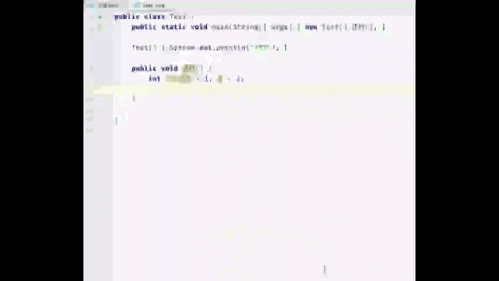

# ChinesePinyinCodeCompletionHelper

> 为啥这里会有一段不符合插件受众的别扭英文介绍💬 [issue-5](https://github.com/tuchg/ChinesePinyin-CodeCompletionHelper/issues/5)

<!-- Plugin description -->

<a href="https://github.com/tuchg/ChinesePinyin-CodeCompletionHelper">Github</a> | <a href="https://github.com/tuchg/ChinesePinyin-CodeCompletionHelper/issues">Issues</a>  

<h3>English</h3>

> The original intention is that for some businesses that are not suitable for expression in English, you can use a straightforward native language instead of pinyin, and then call what is expressed in your native language as you usually write code to solve some naming difficulties 🤔

Let your IDE support Chinese programming, and enjoy the Chinese intelligent coding experience consistent with the English environment

* Input pinyin completion. Chinese identifier will be shown below. Input `zw` and prompt 中文 [**Z**hong **W**en].
* Polyphonic words complete without difference
* Support all identifiers, including variable names, function names, and class names

Compatible with all the Intellij Platform product, indiscriminate Chinese programming, Java, Kotlin, JavaScript, C#，Golang, or Haskell all support...

<h3>中文</h3>

> 初衷在于，一些业务上不太适合用英语表达的，可以用上直白的母语而非拼音，然后像平常写代码那样去调用母语所表达的东西，解决部分命名困难症🤔

让你的 IDE 支持中文编程，享受和英文环境一致的中文智能编码体验

* 拼音输入补全，如上下文存在 中文 标识符, 输入zw，则会补全提示中文【**Z**hong**W**en】
* 多音字无差别补全
* 函数名，变量名，类名 ．．．等标识符，只要能用中文标识的通通都支持
* 支持双拼，五笔等各式输入方法（未来某版本发布✅）

兼容JB 全家桶，无差别中文编程，无论是 Java,JavaScript,Golang,Python,C#,Kotlin,C 艹 亦或者 Haskell 等等通通都支持....

提示：当提示 `no ascii`时，可按提示电灯泡关闭该提示

如果对您有所帮助，别忘了给本项目<a href="https://github.com/tuchg/ChinesePinyin-CodeCompletionHelper">Github</a>主页一颗Star😁

<!-- Plugin description end -->

## 安装

- IDE 内建插件市场:
  
  <kbd>Preferences</kbd> > <kbd>Plugins</kbd> > <kbd>Marketplace</kbd> > <kbd>搜索 "pinyin"</kbd> >
  <kbd>Install Plugin</kbd>
  
- 手动:

  展开 [latest release](https://github.com/tuchg/ChinesePinyin-CodeCompletionHelper/releases/latest) 中的 `Assets` , 找到其下`.jar`文件并下载，而后进入 IDE 
  <kbd>Preferences</kbd> > <kbd>Plugins</kbd> > <kbd>⚙️</kbd> > <kbd>Install plugin from disk...</kbd>

## ToDo list
- [x] 支持多音字补全
- [ ] 支持非拼音输入补全，如五笔,双拼等
- [ ] 支持 Rider 平台 #[issues-4](https://github.com/tuchg/ChinesePinyin-CodeCompletionHelper/issues/4)

## 已知问题
- [ ] 补全项排序问题
- [ ] 各部分算法优化
- [ ] 补全时部分提示信息丢失,如变量数据类型等

---
Plugin based on the [IntelliJ Platform Plugin Template][template].

[template]: https://github.com/JetBrains/intellij-platform-plugin-template
