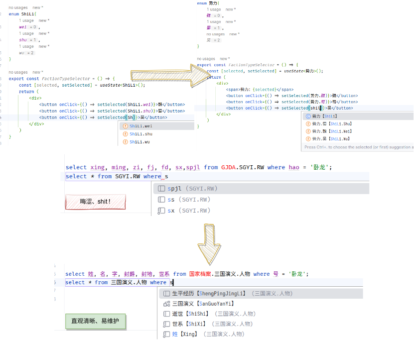

# ChinesePinyinCodeCompletionHelper

<!-- Plugin description -->

<a href="https://github.com/tuchg/ChinesePinyin-CodeCompletionHelper">Github</a>|
<a href="https://gitee.com/tuchg/ChinesePinyin-CodeCompletionHelper">Gitee</a>
| <a href="https://github.com/tuchg/ChinesePinyin-CodeCompletionHelper/issues">Issues</a>

<!-- E -->
> 初衷在于，一些业务上不太适合用英语表达的，可以用上直白的母语而非拼音，然后像平常写代码那样去调用母语所表达的东西，解决部分命名困难症🤔
> 

让你的 IDE 支持中文智能编码，享受和英文环境一致的中文智能编码体验

* 拼音输入补全，如果上下文存在 `中文` 标识符, 输入 zw，则会补全提示中文【**Z**hong**W**en】
* 多音字无差别补全
* 函数名、变量名、类名等等标识符，只要能用中文标识的通通都支持
* 支持双拼、五笔等各式输入方式

兼容 JB 全家桶，无差别中文编码，无论是 Java、Python、JavaScript、Kotlin、Golang、C#、C++ 亦或者 Haskell 等等通通都支持

推荐使用中文命名标识符的场景：

* 因传统文化背景的相关产品标识命名而耽误进度
* 现有项目充斥大量缩写歧义拼音
* 全中文母语开发团队英语素质参差不齐

> 提示：当提示 `no ascii` 时，可按提示电灯泡关闭该提示

如果对您有所帮助，别忘了给本项目<a href="https://github.com/tuchg/ChinesePinyin-CodeCompletionHelper"> Github </a>主页一颗
Star😁，你的支持是项目前进的动力

> 💡 Intellij Platform 2022.1官方支持拼音首字母补全，本插件在此基础已可触发 go、c、kotlin等语言的正常补全，为获得更好体验，推荐原本效果不佳的用户更新至该版本

<!-- Plugin description end -->

## 安装

- IDE 内建插件市场:

  <kbd>Preferences</kbd> > <kbd>Plugins</kbd> > <kbd>Marketplace</kbd> > <kbd>搜索 "pinyin"</kbd> >
  <kbd>Install Plugin</kbd>

- 手动:

  展开 [latest release](https://github.com/tuchg/ChinesePinyin-CodeCompletionHelper/releases/latest) 中的 `Assets` ,
  找到其下`*.jar`文件并下载，而后进入 IDE
  <kbd>Preferences</kbd> > <kbd>Plugins</kbd> > <kbd>⚙️</kbd> > <kbd>Install plugin from disk...</kbd>

## ToDo
- [x] 支持多音字补全
- [x] 已知Kotlin、Go等因语言内部实现冲突，需在中文前添加语言合法ascii字符才能正常触发，经[IDEA-251113](https://github.com/JetBrains/intellij-community/commit/71a587c4b23667bb09d1f1dc830647b133953a9e) 支持已可运作，已于 `2022.1 EAP`集成
- [x] 提供搜索/替换框内的拼音中文补全 
- [x] 添加可视化配置界面
- [x] 支持非全拼输入补全，如五笔、双拼等 ( [RIME](https://github.com/rime) 导入)
- [ ] [多语言编程的设想：将变量名与自然语言解耦](https://www.v2ex.com/t/701390)
- [ ] [基于 IDE 的中文输入法](https://gitee.com/Program-in-Chinese/vscode_Chinese_Input_Assistant/issues/I5YGO3)
- [ ] [中文代码的特殊排版](https://github.com/tuchg/ChinesePinyin-CodeCompletionHelper/issues/67)

## 相关资源

* <a href="https://gitee.com/Program-in-Chinese/vscode_Chinese_Input_Assistant">中文代码快速补全 VS Code 插件</a>
* <a href="https://github.com/stratosblue/ChinesePinyinIntelliSenseExtender">VisualStudio汉语拼音拓展</a>
* <a href="https://github.com/duolabmeng6/pyefun">Python 易函数 (语言标准API汉化库)</a>

## 参与项目

欢迎对本项目感兴趣的同学PR，共同维护，commit message 遵守
[emoji-commit](https://gitmoji.carloscuesta.me/) 规范

了解如何参与维护开发及现有bug思路可参考[此处](doc/Bugs解决思路.md)

## Star History

<a href="https://star-history.com/#tuchg/ChinesePinyin-CodeCompletionHelper&Date">
  <picture>
    <source media="(prefers-color-scheme: dark)" srcset="https://api.star-history.com/svg?repos=tuchg/ChinesePinyin-CodeCompletionHelper&type=Date&theme=dark" />
    <source media="(prefers-color-scheme: light)" srcset="https://api.star-history.com/svg?repos=tuchg/ChinesePinyin-CodeCompletionHelper&type=Date" />
    
  </picture>
</a>

---
Plugin based on the [IntelliJ Platform Plugin Template][template].

[template]: https://github.com/JetBrains/intellij-platform-plugin-template
