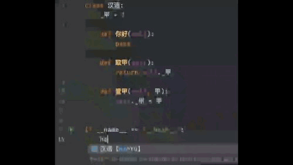

# ChinesePinyinCodeCompletionHelper

<!-- Plugin description -->

<a href="https://github.com/tuchg/ChinesePinyin-CodeCompletionHelper">Github</a>
| <a href="https://github.com/tuchg/ChinesePinyin-CodeCompletionHelper/issues">Issues</a>

<!-- E -->

> 初衷在于，一些业务上不太适合用英语表达的，可以用上直白的母语而非拼音，然后像平常写代码那样去调用母语所表达的东西，解决部分命名困难症🤔

让你的 IDE 支持中文编程，享受和英文环境一致的中文智能编码体验

* 拼音输入补全，如上下文存在 `中文` 标识符, 输入 zw，则会补全提示中文【**Z**hong**W**en】
* 多音字无差别补全
* 函数名、变量名、类名等等标识符，只要能用中文标识的通通都支持
* 支持双拼、五笔等各式输入方法（未来某版本发布✅）

兼容 JB 全家桶，无差别中文编程，无论是 Java、Python、JavaScript、Kotlin、Golang、、C#、C 艹 亦或者 Haskell 等等通通都支持

提示：当提示 `no ascii` 时，可按提示电灯泡关闭该提示

如果对您有所帮助，别忘了给本项目<a href="https://github.com/tuchg/ChinesePinyin-CodeCompletionHelper"> Github </a>主页一颗 Star😁

<!-- Plugin description end -->

## 安装

- IDE 内建插件市场:

  <kbd>Preferences</kbd> > <kbd>Plugins</kbd> > <kbd>Marketplace</kbd> > <kbd>搜索 "pinyin"</kbd> >
  <kbd>Install Plugin</kbd>

- 手动:

  展开 [latest release](https://github.com/tuchg/ChinesePinyin-CodeCompletionHelper/releases/latest) 中的 `Assets` ,
  找到其下`*.jar`文件并下载，而后进入 IDE
  <kbd>Preferences</kbd> > <kbd>Plugins</kbd> > <kbd>⚙️</kbd> > <kbd>Install plugin from disk...</kbd>

## ToDo

- [x] 支持多音字补全
- [ ] 
  提供搜索/替换框内的拼音中文补全,平台开放API尚处试验阶段,且使用频率不高,暂且搁置 [#issues-8](https://github.com/tuchg/ChinesePinyin-CodeCompletionHelper/issues/8)
- [ ] 添加可视化配置界面
- [ ] 支持非全拼输入补全，如五笔、双拼等
- [ ] [多语言编程的设想：将变量名与自然语言解耦](https://www.v2ex.com/t/701390)

## 已知问题

- [ ] 已知Kotlin、Go等因语言内部实现冲突，需在中文前添加语言合法ascii字符才能正常触发，[bug解决思路](doc/Bugs解决思路.md) 相关issues: #10 #4 #6
- [ ] 中文包下中文类,补全其他包内容时未能自动出现问题 *双击补全键解决或给出更精确的输入*
- [x] 补全项排序问题 ☑︎已第三次优化,大部分语言已正常排序
- [x] 大写英文带中文补全问题 [#issues-6](https://github.com/tuchg/ChinesePinyin-CodeCompletionHelper/issues/6)
- [x] 中文包下中文类,调用本类名相关补全时当前类重复出现一次的问题
- [x] 各部分算法优化
- [x] 补全时部分提示信息丢失,如变量数据类型,包位置等

## 相关推荐

* <a href="https://gitee.com/Program-in-Chinese/vscode_Chinese_Input_Assistant">中文代码快速补全 VS Code 插件</a>
* <a href="https://github.com/duolabmeng6/pyefun">Python 易函数 (语言标准API汉化库)</a>
* <a href="https://github.com/duolabmeng6/goefun">Golang 易函数</a>

## 贡献

欢迎感兴趣的同学提交 PR 参与维护
[emoji commit参考](https://gitmoji.carloscuesta.me/)

了解如何参与维护开发及现有bug思路可参考[此处](doc/)

## Thanks

Development powered by [JetBrains](https://www.jetbrains.com/?from=ChinesePinyinCodeCompletionHelper).

Whichever technologies you use, there's a JetBrains tool to match.

---
Plugin based on the [IntelliJ Platform Plugin Template][template].

[template]: https://github.com/JetBrains/intellij-platform-plugin-template
