编程语言按字母顺序排列。

### Go

测试环境：GoLand 2020.3.1

[例程](例程/go) 改编自 [Go 官方文档](https://golang.org/doc/tutorial/call-module-code)

- 模块方法：

  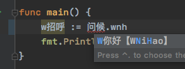

- 局部变量：

  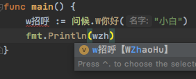

### Java

测试环境：IntelliJ IDEA 2020.3 (Community Edition)

[例程](例程/java)

- 函数调用

  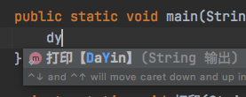

  - 英文前缀

    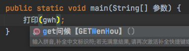

- 变量

  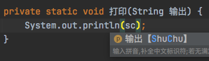

- 类型

  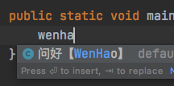

### Kotlin

测试环境：IntelliJ IDEA 2020.2.4 (Community Edition)

- 变量

  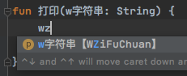

### Python
测试环境：PyCharm 2020.3 (Community Edition)

[例程](例程/python)

- 函数调用

  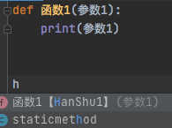

- 变量

  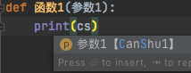

- 导入模块

  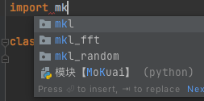

- 导入模块内的函数调用

  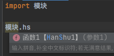
